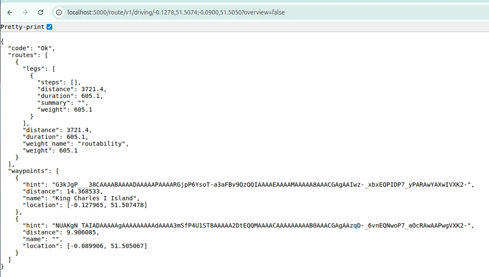

🚀 Open-source. A comprehensive geospatial mapping API service combining Nominatim (geocoding/reverse geocoding) and OSRM (routing) with Docker containerization. Provides a complete open-source alternative to commercial mapping services with London-focused optimization.
✨ **Features:**
- 📍 **Nominatim** - Full geocoding & reverse geocoding (address ↔ coordinates)
- 🛣️ **OSRM** - Fast, open-source routing engine
- ⚡ **Redis** - Intelligent caching for performance
- 🗄️ **PostgreSQL + PostGIS** - Spatial database backend
- 🐳 **Docker Compose** - Easy deployment & scaling
- 🔧 **Fully customizable** - Use any OSM region data
- 🔧 **- RESTful API endpoints**
🏗️ Tech Stack: Docker, _Node.js_, Nominatim, OSRM, PostgreSQL/PostGIS, Redis, Nginx

### Step 1 see `fix-permissions.sh` or use below commands
```shell
# Create the data directory structure
mkdir -p data/postgres-nominatim data/nominatim data/nominatim-flatnode data/osrm data/redis data/cache logs

# Set permissions to 777 for all data directories
sudo chmod -R 777 data/ logs/

# Set ownership to your user (optional, but good for manual access)
sudo chown -R $USER:$USER data/ logs/

# Now run docker-compose
docker-compose up -d
```

### Map files
```shell
sudo chmod 777 osm-data/ -R
sudo chmod 777 data/ -R
chmod 644 ./osm-data/great-britain-260114.osm.pbf
```

### manually extract
```shell
sudo apt-get update
sudo apt-get install -y osmium-tool

mkdir -p ./data/osrm
# Fix permissions for the data directory
sudo chown -R $USER:$USER ./data
sudo chmod -R 755 ./data
sudo chmod -R 777 ./data

# Create necessary directories
mkdir -p ./data/{postgres-nominatim,osrm,nominatim,nominatim-flatnode,redis,cache,logs}

osmium extract \
  -b "-0.52,51.28,0.33,51.72" \
  ./osm-data/great-britain-260114.osm.pbf \
  -o ./data/osrm/london.osm.pbf \
  --overwrite
```

### Docker logs check
```shell
docker compose logs osrm-backend
docker compose logs nominatim-api
```

### port issue docker-compose
```shell
sudo ss -tulpn | grep -E ':3101|:3102|:5434|:5001|:8181|:6380|:8282'
```

### Stop and remove all containers (just to be safe)
```shell
docker compose down --rmi all -v --remove-orphans
 
#[+] down 6/6
# ✔ Image redis:7-alpine                       Removed    1.5s 
# ✔ Image mediagis/nominatim:4.3               Removed    1.5s 
# ✔ Image adminer:latest                       Removed    1.5s 
# ✔ Image manwithvan_mapservice-map-api:latest Removed    1.5s 
# ✔ Image osrm/osrm-backend:latest             Removed    1.5s 
# ✔ Image postgis/postgis:16-3.4               Removed    1.5s
 
 
#Optional: prune unused Docker resources (extra cleanup)
docker system prune -af
docker volume prune -f

# Total reclaimed space: 11.05GB
#Total reclaimed space: 0B
```

### ports
```shell
map-api → 3101:3001, 3102:3002
osrm-backend → 5000:5000
nominatim-api → 8181:8080
postgres → 5434:5432
redis → 6380:6379
adminer → 8282:8080
```

### Map files
```shell
sudo chmod 644 ./osm-data/great-britain-260114.osm.pbf
```

### Docker
```shell
# Check Docker Compose availability
which docker-compose
docker compose version

# Check Docker daemon
sudo systemctl status docker

# Add user to docker group (if permission issues)
sudo usermod -aG docker $USER
newgrp docker  # <<< Or log out and back in

# Test Docker
docker run hello-world

# If using snap
snap list | grep docker

# 1. Monitor Download Progress
# Watch the download progress in real-time
docker compose logs -f

# Or check individual services
docker compose logs -f nominatim-api
```

### Download OSM files
- https://download.geofabrik.de/europe/united-kingdom/england/greater-london-260114.osm.pbf

download file and paste it in
```shell 
{project}/osm-data/greater-london-260114.osm.pbf
```

### Check Service Status
```shell
# After images finish downloading, check status
docker compose ps

# Check if containers are healthy
docker compose exec nominatim-api curl http://localhost:8080/status

curl http://localhost:3001/health
```

### docker-compose.yml London 166MB file
```shell
services:
  map-api:
    build: .
    container_name: map-api
    restart: unless-stopped
    ports:
      - "3101:3001"
      - "3102:3002"
    environment:
      - NODE_ENV=${NODE_ENV:-development}
      - PORT=3001
      - SOCKET_PORT=3002
      - NOMINATIM_URL=${NOMINATIM_URL}  # Will be http://nominatim-api:8080
      - OSRM_URL=${OSRM_URL}            # Will be http://osrm-backend:5000
      - REDIS_URL=${REDIS_URL}          # Will be redis://redis:6379
      - CACHE_TTL=3600
      - LONDON_BOUNDS=${LONDON_WEST:-0.52},${LONDON_SOUTH:-51.28},${LONDON_EAST:-0.33},${LONDON_NORTH:-51.72}
    volumes:
      - ./src:/app/src
      - ./data/cache:/app/data/cache
      - ./logs:/app/logs
      - ./osm-data:/app/osm-data:ro
    depends_on:
      nominatim-postgres:
        condition: service_healthy
      osrm-backend:
        condition: service_healthy
      redis:
        condition: service_healthy
    healthcheck:
      test: ["CMD", "curl", "-f", "http://localhost:3001/health"]
      interval: 30s
      timeout: 10s
      retries: 3

  nominatim-postgres:
    image: postgis/postgis:16-3.4
    container_name: nominatim-postgres
    restart: unless-stopped
    environment:
      POSTGRES_DB: nominatim
      POSTGRES_USER: nominatim
      POSTGRES_PASSWORD: ${POSTGRES_PASSWORD:-nominatim_password}
      POSTGRES_MULTIPLE_EXTENSIONS: postgis,hstore,postgis_topology,postgis_raster,pgrouting
    volumes:
      - ./data/postgres-nominatim:/var/lib/postgresql/data
      - ./config/postgres-init:/docker-entrypoint-initdb.d:ro
      - ./osm-data:/osm-data:ro
    ports:
      - "5434:5432"
    command: >
      postgres
      -c shared_preload_libraries=pg_stat_statements
      -c pg_stat_statements.track=all
      -c max_connections=100
      -c shared_buffers=1GB
      -c maintenance_work_mem=256MB
      -c checkpoint_completion_target=0.9
      -c work_mem=16MB
    shm_size: 1gb
    healthcheck:
      test: ["CMD-SHELL", "pg_isready -U nominatim"]
      interval: 10s
      timeout: 5s
      retries: 10
      start_period: 30s

  osrm-backend:
    image: osrm/osrm-backend:latest
    container_name: osrm-backend
    restart: unless-stopped
    volumes:
      - ./data/osrm:/data
      - ./osm-data/greater-london-260114.osm.pbf:/data/london.osm.pbf:ro
    ports:
#      - "${OSRM_HOST_URL##*:}:5000"  # Will extract 5001 from http://localhost:5001
      - "5000:5000"
    environment:
      - OSRM_ALGORITHM=mld
    command: >
      /bin/sh -c "
        # Set permissions on /data
        chmod 777 /data 2>/dev/null || true
      
        # Process the London data if not already processed
        if [ ! -f /data/london.osm.pbf.osrm ]; then
          echo '⚙️ Processing London data for routing...'
          osrm-extract -p /opt/car.lua /data/london.osm.pbf
          osrm-partition /data/london.osm.pbf
          osrm-customize /data/london.osm.pbf
          echo '✅ OSRM processing complete!'
        else
          echo '✅ Using pre-processed OSRM data'
        fi
      
        echo '🚗 Starting OSRM routing engine...'
        osrm-routed --algorithm mld /data/london.osm.pbf
      "
    healthcheck:
      test: [ "CMD", "curl", "-f", "http://localhost:5000/route/v1/driving/-0.1278,51.5074;-0.0900,51.5050?overview=false" ]
      interval: 30s
      timeout: 10s
      retries: 10  # Increased from 5
      start_period: 180s  # Increased from 120s (give more startup time)
      start_interval: 30s  # Add this - check every 30s during start_period

  nominatim-api:
    image: mediagis/nominatim:4.3
    container_name: nominatim-api
    restart: unless-stopped
    environment:
      - PBF_PATH=/osm-data/greater-london-260114.osm.pbf
      - IMPORT_STYLE=admin
      - IMPORT_WIKIPEDIA=false
      - NOMINATIM_PASSWORD=${POSTGRES_PASSWORD:-nominatim_password}
      - THREADS=4
      - FREEZE_DB=false
    volumes:
      - ./data/nominatim:/var/lib/postgresql/14/main
      - ./data/nominatim-flatnode:/flatnode
      - ./osm-data:/osm-data:ro
    ports:
      - "8181:8080"
    depends_on:
      nominatim-postgres:
        condition: service_healthy
    command: >
      sh -c "
        # Set permissions on data directories
        chmod 777 /var/lib/postgresql/14/main 2>/dev/null || true
        chmod 777 /flatnode 2>/dev/null || true
      
        # Check if import is needed
        if [ ! -f /var/lib/postgresql/14/main/NOTES ]; then
          echo '📊 Importing London data into Nominatim...'
          nominatim import --osm-file /osm-data/greater-london-260114.osm.pbf --threads 4
      
          echo '🔧 Setting up website and indexes...'
          nominatim refresh --website --functions
      
          echo '✅ Nominatim setup complete!'
        else
          echo '✅ Using existing Nominatim database'
        fi
      
        # Start Apache
        echo '🌐 Starting web server...'
        apache2ctl -D FOREGROUND
      "
    shm_size: 2gb
    healthcheck:
      test: ["CMD", "curl", "-f", "http://localhost:8080/status"]
      timeout: 30s
      retries: 15
      start_period: 300s

  redis:
    image: redis:7-alpine
    container_name: map-redis
    restart: unless-stopped
    ports:
#      - "${REDIS_HOST_URL##*:}:6379"  # Will extract 6380 from redis://localhost:6380
      - "6380:6379"
    volumes:
      - ./data/redis:/data
    command: >
      sh -c "
        # Set permissions on data directory
        chmod 777 /data 2>/dev/null || true
      
        # Start redis
        redis-server
        --appendonly yes
        --requirepass ${REDIS_PASSWORD:-redis_map_pass}
        --maxmemory 512mb
        --maxmemory-policy allkeys-lru
      "
    healthcheck:
      test: ["CMD-SHELL", "redis-cli -a ${REDIS_PASSWORD:-redis_map_pass} ping | grep PONG"]
      timeout: 5s
      retries: 5
      start_period: 10s

  adminer:
    image: adminer
    container_name: map-adminer
    restart: unless-stopped
    ports:
      - "8282:8080"
    environment:
      ADMINER_DEFAULT_SERVER: nominatim-postgres
    depends_on:
      - nominatim-postgres
```

### docker-compose.yml (with different osm file)
UK 2.1GB file. (review: docker-compose.yml London 166MB file)
```shell
  ...
  ...
  # OSRM Backend - Using your downloaded file
  osrm-backend:
    image: osrm/osrm-backend:latest
    container_name: osrm-backend
    restart: unless-stopped
    volumes:
      - ./data/osrm:/data
      - ./osm-data:/osm-data:ro
      - ./scripts:/scripts
    ports:
      - "5001:5000"
    command: >
      /bin/sh -c "
        # Extract London from full GB file using osmium-tool
        if [ ! -f /data/london.osm.pbf ]; then
          echo '🚀 Extracting London from full GB OSM file...'
          apt-get update && apt-get install -y osmium-tool && \
          osmium extract \
            -b '-0.52,51.28,0.33,51.72' \
            /osm-data/great-britain-260114.osm.pbf \
            -o /data/london.osm.pbf \
            --overwrite
          echo '✅ London extraction complete!'
        fi
      
        # Process for OSRM
        if [ ! -f /data/london.osm.pbf.osrm ]; then
          echo '⚙️ Processing London data for routing...'
          osrm-extract -p /opt/car.lua /data/london.osm.pbf
          osrm-partition /data/london.osm.pbf
          osrm-customize /data/london.osm.pbf
          echo '✅ OSRM processing complete!'
        fi
      
        echo '🚗 Starting OSRM routing engine...'
        osrm-routed --algorithm mld /data/london.osm.pbf
      "
    healthcheck:
      test: ["CMD", "curl", "-f", "http://localhost:5000/route/v1/driving/-0.1278,51.5074;-0.0900,51.5050?overview=false"]
      timeout: 60s
      retries: 10
      start_period: 120s

  nominatim-api:
    image: mediagis/nominatim:4.3
    container_name: nominatim-api
    restart: unless-stopped
    environment:
      - PBF_PATH=/osm-data/great-britain-260114.osm.pbf
      - IMPORT_STYLE=admin
      - IMPORT_WIKIPEDIA=false
      - NOMINATIM_PASSWORD=${POSTGRES_PASSWORD:-nominatim_password}
      - THREADS=4
      - FREEZE_DB=false
    volumes:
      - ./data/nominatim:/var/lib/postgresql/14/main
      - ./data/nominatim-flatnode:/flatnode
      - ./osm-data:/osm-data:ro
      - ./scripts:/scripts
    ports:
      - "8181:8080"  # Changed from 8080
    depends_on:
      nominatim-postgres:
        condition: service_healthy
    command: >
      sh -c "
        # First, extract London from full GB file
        echo '🗺️ Extracting London area from GB OSM file...'
        apt-get update && apt-get install -y osmium-tool && \
        osmium extract \
          -b '-0.52,51.28,0.33,51.72' \
          /osm-data/great-britain-260114.osm.pbf \
          -o /tmp/london.osm.pbf \
          --overwrite
      
        # Import only London data
        echo '📊 Importing London data into Nominatim...'
        nominatim import --osm-file /tmp/london.osm.pbf --threads 4
      
        # Set up website and indexes
        echo '🔧 Setting up website and indexes...'
        nominatim refresh --website --functions
      
        echo '✅ Nominatim setup complete!'
      
        # Start Apache
        echo '🌐 Starting web server...'
        apache2ctl -D FOREGROUND
      "
    shm_size: 2gb
    healthcheck:
      test: ["CMD", "curl", "-f", "http://localhost:8080/status"]
      timeout: 30s
      retries: 15
      start_period: 300s
  ...
  ...
```

### Check service OSRM_URL

- http://localhost:5000/route/v1/driving/-0.1278,51.5074;-0.0900,51.5050?overview=false
```shell
{
  "code": "Ok",
  "routes": [
    {
      "legs": [
        {
          "steps": [],
          "distance": 3721.4,
          "duration": 605.1,
          "summary": "",
          "weight": 605.1
        }
      ],
      "distance": 3721.4,
      "duration": 605.1,
      "weight_name": "routability",
      "weight": 605.1
    }
  ],
  "waypoints": [
    {
      "hint": "G3kJgP___38CAAAABAAAADAAAAAPAAAARGjpP6YsoT-a3aFBv9QzQQIAAAAEAAAAMAAAAA8AAACGAgAAIwz-_xbxEQPIDP7_yPARAwYAXwIVXK2-",
      "distance": 14.368533,
      "name": "King Charles I Island",
      "location": [-0.127965, 51.507478]
    },
    {
      "hint": "NUAKgN_TAIADAAAAAgAAAAAAAAAdAAAA3mSfP4U1ST8AAAAA2DtEQQMAAAACAAAAAAAAAB0AAACGAgAAzqD-_6vnEQNwoP7_aOcRAwAAPwgVXK2-",
      "distance": 9.906085,
      "name": "",
      "location": [-0.089906, 51.505067]
    }
  ]
}
```


### Debug
hit: `docker compose build map-api` if permission issue then
```shell
# Change ownership of data directories
sudo chown -R $USER:$USER data/

# Or set appropriate permissions
sudo chmod -R 755 data/

# Or if you're using Docker with sudo
sudo chmod -R a+rw data/

docker compose build map-api
```