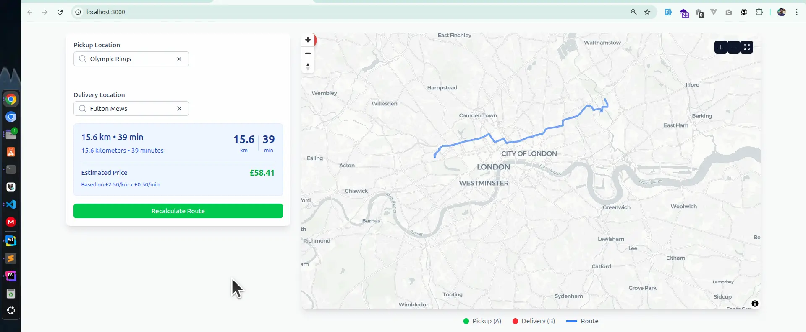
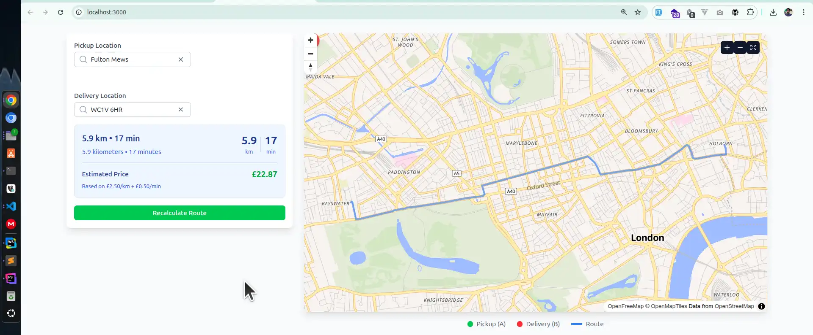
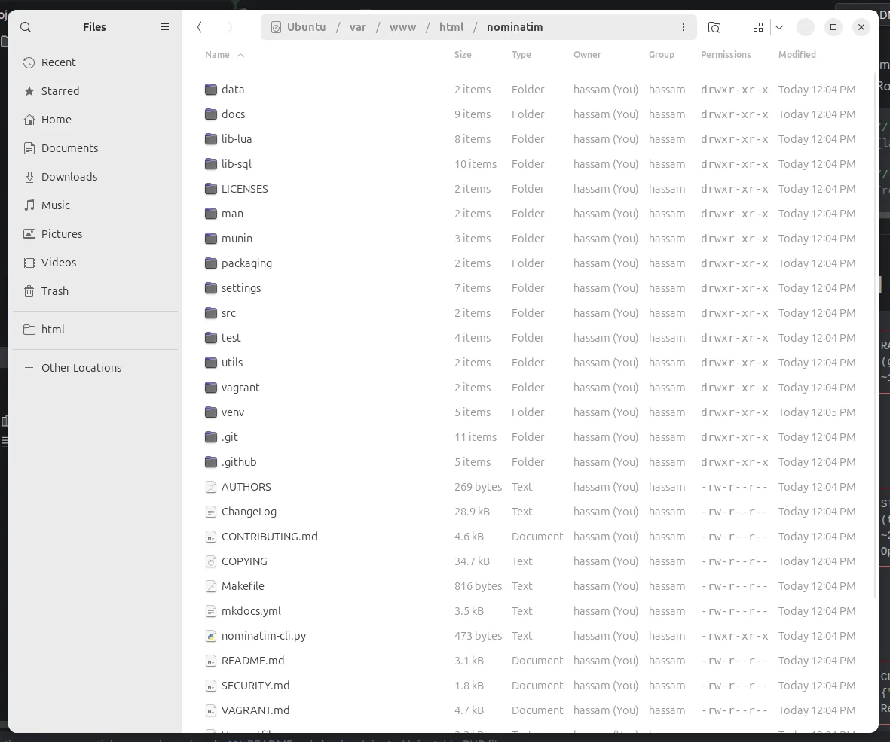
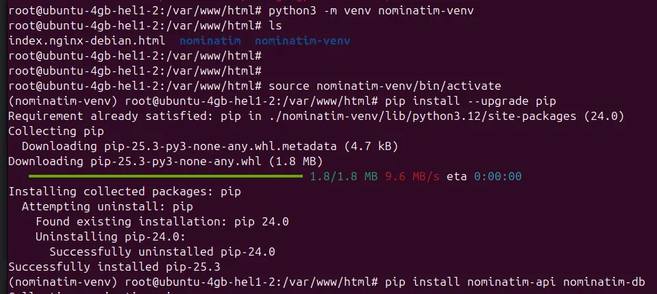
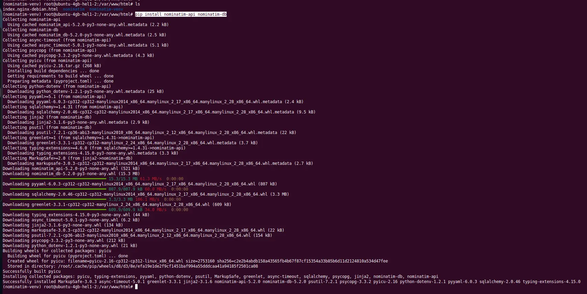
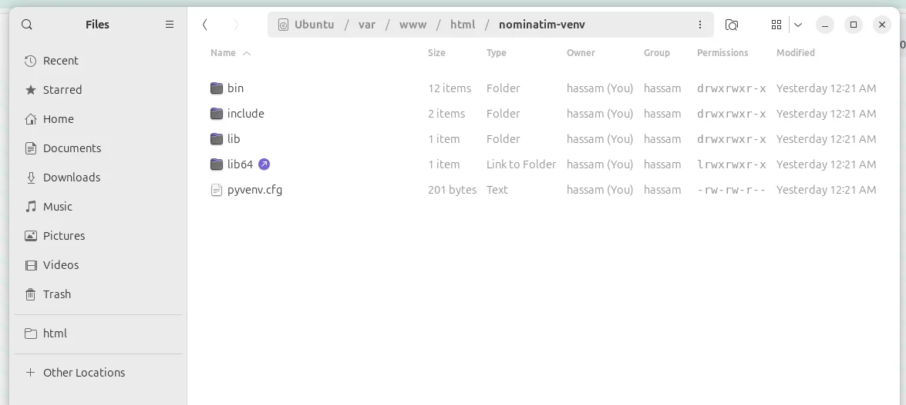
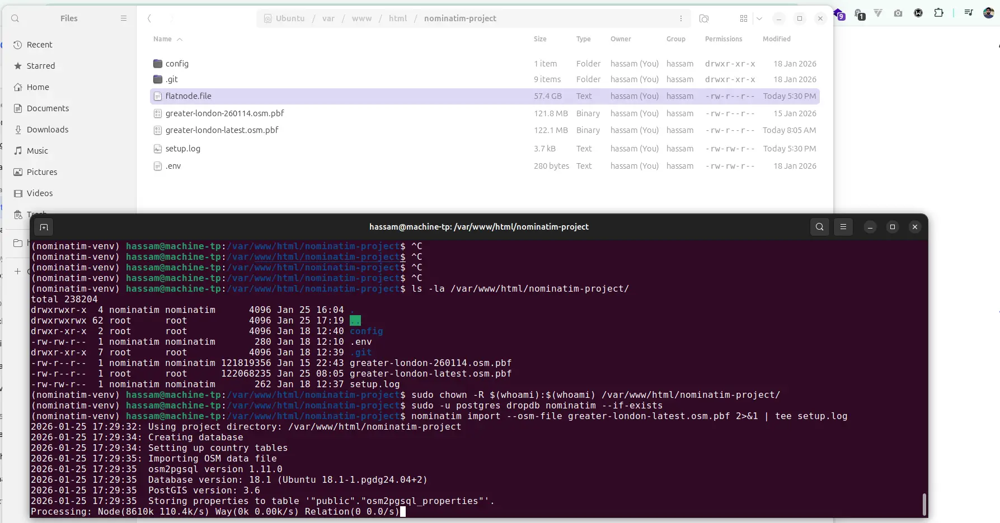
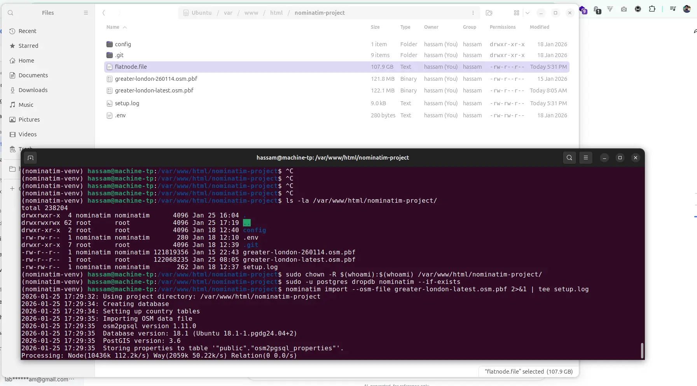
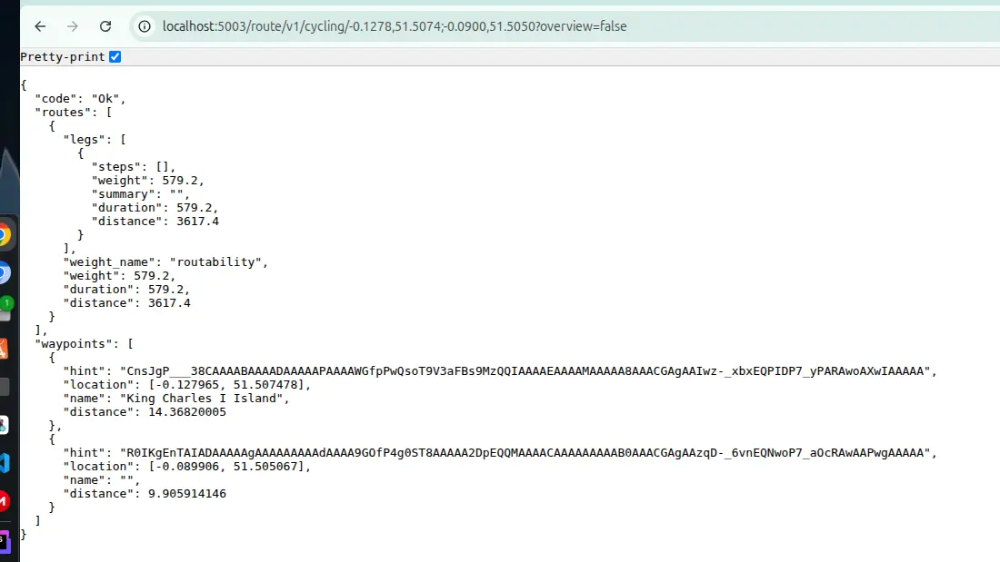
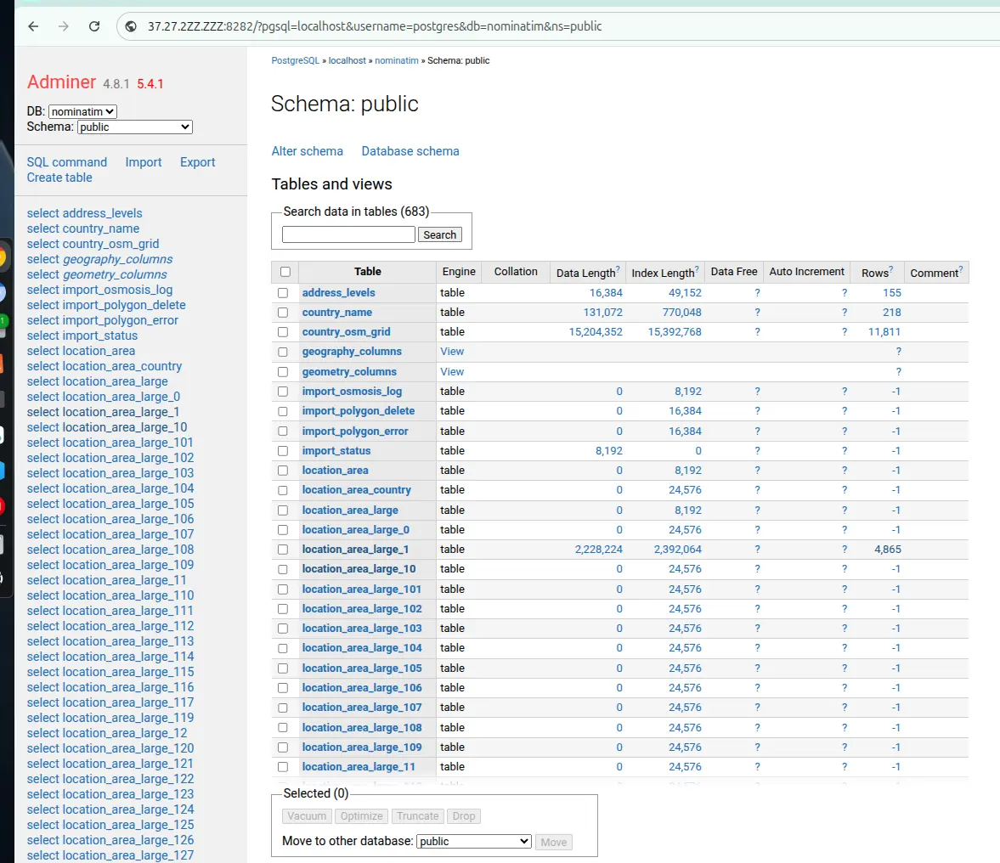

🚀 Open-source. A comprehensive geospatial mapping API service combining Nominatim (geocoding/reverse geocoding) and
OSRM (routing) with Docker containerization. Provides a complete open-source alternative to commercial mapping services
with London-focused optimization.
✨ **Features:**

- 📍 **Nominatim** - Full geocoding & reverse geocoding (address ↔ coordinates)
- 🛣️ **OSRM** - Fast, open-source routing engine (optional)
- ⚡ **Redis** - Intelligent caching for performance
- 🗄️ **PostgreSQL + PostGIS** - Spatial database backend
- 🐳 **Docker Compose** - Easy deployment & scaling
- 🔧 **Fully customizable** - Use any OSM region data
- 🔧 **RESTful API endpoints**

🏗️ Tech Stack: Docker, PHP, Nominatim, OSRM, PostgreSQL/PostGIS, Redis, Nginx
 
---
- Nominatim: Geocoding "Where is this address?" port:8181
- OSRM: Routing How do I get from A to B? port:5000
```shell
curl "http://localhost:8181/?q=Buckingham Palace"
# Returns: {lat: 51.501, lon: -0.142, address: "Buckingham Palace..."}

curl "http://localhost:5003/route/v1/driving/-0.142,51.501;-0.090,51.505"
# Returns: {routes: [{distance: 4500m, duration: 600s, geometry: [...], turns: [...]}]}
```
---

<details>
<summary><strong>API Video Preview</strong></summary>

[preview.mp4](public/images/preview.mp4)

https://github.com/user-attachments/assets/7bb5afc6-5f29-4650-91b2-ffa0f4a1ecbd

</details>

Project Nuxt live search and map draw video preview: [preview.mp4](public/images/preview_3x.mp4)

https://github.com/user-attachments/assets/836e7276-980f-40f2-a04e-42834804356d

| Preview 1 | Preview 2 |
|----------|-----------|
|  |  |


## Manual Setup
```shell
┌─────────────────────────────────────────────────────┐
│         RAW OSM DATA FILE                           │
│         (greater-london-260114.osm.pbf)             │
│         ~120MB binary file                          │
└───────────────┬─────────────────────────────────────┘
                │
                │ Processed by: nominatim-venv tools
                │ Command: nominatim import
                │
                ▼
┌─────────────────────────────────────────────────────┐
│         STRUCTURED POSTGRESQL DATABASE              │
│         (tables: placex, location_road_0, etc.)     │
│         ~2-3GB with indexes                         │
│         Optimized for fast text search              │
└───────────────┬─────────────────────────────────────┘
                │
                │ Queried by: Your PHP/Node.js/Laravel
                │ SQL: SELECT * FROM placex WHERE...
                │
                ▼
┌─────────────────────────────────────────────────────┐
│         CLEAN API RESPONSE                          │
│         {"lat": 51.5074, "lon": -0.1278, ...}       │
│         Ready for your application                  │
└─────────────────────────────────────────────────────┘
```
#### Component Summary

| Component | Purpose | Frequency | Delete? |
|-----------|---------|-----------|---------|
| **nominatim-venv** | Process raw OSM → database | Once/setup | No (need for updates) |
| **PostgreSQL** | Store processed, searchable data | Always on | No (your data!) |
| **PHP API** | Query the database | Every search | No (your application) |


##### Q. can we use mysql instead of postgress?
No, you cannot use MySQL instead of PostgreSQL for Nominatim. It's technically impossible because Nominatim has a hard dependency on PostgreSQL with PostGIS extensions.
Technical Impossibilities
PostGIS is Non-Negotiable
Nominatim requires these PostgreSQL extensions that don't exist in MySQL:
- PostGIS - Advanced geospatial functions (ST_DWithin, ST_Distance, etc.)
- PostGIS Topology - Spatial relationship calculations
- hstore - Key-value storage for OSM tags (MySQL has JSON but different syntax)
- PostgreSQL Full-Text Search - Special text indexing (tsvector, tsquery)

### Resource Requirements (London Only)

| Service                    | Minimum RAM | Disk Space    | CPU Load      | Notes                          |
|----------------------------|-------------|---------------|---------------|--------------------------------|
| **Nominatim (PostgreSQL)** | 2-4 GB      | 500 MB - 1 GB | Medium        | London data is small           |
| **OSRM Processing**        | 2-4 GB      | 300-500 MB    | Heavy (hours) | Only during initial processing |
| **OSRM Running**           | 512 MB      | 400 MB        | Medium        | After processing               |
| **System + Nginx/PHP**     | 1-2 GB      | 5 GB          | Low           | -                              |
| **Redis**                  | 128 MB      | 100 MB        | Caching       | .                              |
| **TOTAL**                  | **3-7 GB**  | **4-8 GB**    | -             | -                              |

___
___
first lets check enabled ports
```shell
grep -R "listen" /etc/nginx/sites-enabled/
/etc/nginx/sites-enabled/nominatim:    listen 8181;
/etc/nginx/sites-enabled/adminer:    listen 8282;
/etc/nginx/sites-enabled/default:	listen 80 default_server;
/etc/nginx/sites-enabled/default:	listen [::]:80 default_server;
/etc/nginx/sites-enabled/default:	# listen 443 ssl default_server;
/etc/nginx/sites-enabled/default:	# listen [::]:443 ssl default_server;
/etc/nginx/sites-enabled/default:#	listen 80;
/etc/nginx/sites-enabled/default:#	listen [::]:80; 
```

## 1. postgres install
https://www.postgresql.org/download/linux/ubuntu/
```shell
# Automated repository configuration:
sudo apt install -y postgresql-common
sudo /usr/share/postgresql-common/pgdg/apt.postgresql.org.sh

# START: To manually configure the Apt repository, follow these steps:
sudo apt install curl ca-certificates
sudo install -d /usr/share/postgresql-common/pgdg
sudo curl -o /usr/share/postgresql-common/pgdg/apt.postgresql.org.asc --fail https://www.postgresql.org/media/keys/ACCC4CF8.asc
. /etc/os-release

sudo sh -c "echo 'deb [signed-by=/usr/share/postgresql-common/pgdg/apt.postgresql.org.asc] https://apt.postgresql.org/pub/repos/apt $VERSION_CODENAME-pgdg main' > /etc/apt/sources.list.d/pgdg.list"
sudo apt update
# END: To manually configure the Apt repository, follow these steps:

# Install PostgreSQL: (replace "18" by the version you want)
sudo apt install postgresql-18

# Start and enable PostgreSQL
sudo systemctl start postgresql
sudo systemctl enable postgresql
sudo apt install -y postgis postgresql-18-postgis-3
```

### 1.1 Install Git
```shell
sudo apt install git -y
```

### 1.2 Nginx
```shell
sudo apt update
sudo apt upgrade

sudo apt install nginx

# Start, stop, or restart Nginx using systemctl:
sudo systemctl start nginx
sudo systemctl restart nginx
sudo systemctl status nginx
sudo systemctl stop nginx (to stop)
```

### 1.3 PHP-FPM
```shell
#===== FOR Ubuntu ======#
sudo apt install software-properties-common gnupg2 -y
sudo add-apt-repository ppa:ondrej/php -y
sudo apt update -y
#===== FOR Ubuntu ======#

#===== FOR Debain ======#
# Enable the SURY PHP repository (required)
sudo apt update
sudo apt install -y ca-certificates apt-transport-https curl lsb-release gnupg

# Add the GPG key:
curl -fsSL https://packages.sury.org/php/apt.gpg \
| sudo gpg --dearmor -o /usr/share/keyrings/php.gpg

# Add the repo:
echo "deb [signed-by=/usr/share/keyrings/php.gpg] https://packages.sury.org/php/ $(lsb_release -sc) main" \
| sudo tee /etc/apt/sources.list.d/php.list
#===== FOR Debain ======#

sudo apt update
sudo apt install -y php8.4-fpm php8.4-cli php8.4-intl php8.4-pgsql php8.4-curl php8.4-mysql php8.4-pgsql php8.4-redis php8.4-curl php8.4-xml php8.4-mbstring php8.4-zip
sudo apt install -y php8.3-fpm php8.3-cli php8.3-intl php8.3-pgsql php8.3-curl php8.3-mysql php8.3-pgsql php8.3-redis php8.3-curl php8.3-xml php8.3-mbstring php8.3-zip
systemctl status php8.4-fpm
update-alternatives --list php

# Switch default CLI:
sudo update-alternatives --config php
```

### 1.3 MySQL MariaDB installation (optional)
<details> <summary>Click to expand MariaDB installation steps</summary>

```
sudo apt install mariadb-server
sudo apt install mariadb-client-compat
systemctl status mariadb```

# Secure MariaDB Installation
sudo mysql_secure_installation

# Enter current password for root (enter for none):
# entry password e.g `P@$$w0rd!`

# Setting the root password or using the unix_socket ensure that nobody can log into the MariaDB root user without the proper authorisation.
# You already have root account protected, so you can safely answer 'n'.
# Switch to unix_socket authentication [Y/n] n
# ... skipping.

# You already have your root account protected, so you can safely answer "n"

# Change the root password? [Y/n] Y
New password: ******** e.g P@$$w0rd!
Re-enter new password: ******** e.g P@$$w0rd!

# By default, a MariaDB installation has an anonymous user, allowing anyone to log into MariaDB without having to have a user account created for
# them. This is intended only for testing, and to make the installation go a bit smoother. You should remove them before moving into a production environment.
Remove anonymous users? [Y/n] n

# Normally, root should only be allowed to connect from 'localhost'. This ensures that someone cannot guess at the root password from the network.
# Disallow root login remotely? [Y/n] n

# By default, MariaDB comes with a database named 'test' that anyone can access.  This is also intended only for testing, and should be removed before moving into a production # environment.
Remove test database and access to it? [Y/n] n

Reload privilege tables now? [Y/n] Y
... Success!

mysql -u root -p P@$$w0rd!
```

</details>

## 2. Install Nominatim
#### Install dependencies
```shell
sudo apt update
sudo apt install -y \
    build-essential \
    cmake \
    g++ \
    curl \
    wget \
    osm2pgsql \
    postgresql-contrib \
    python3-dev \
    python3-venv \
    python3-pip \
    python3-psycopg2 \
    python3-psutil \
    python3-jinja2 \
    python3-setuptools \
    libboost-dev \
    libboost-system-dev \
    libboost-filesystem-dev \
    libexpat1-dev \
    zlib1g-dev \
    libbz2-dev \
    libpq-dev \
    libproj-dev \
    lua5.3 \
    liblua5.3-dev \
    libluabind-dev
```

#### Create database and user
```shell
-- 1. create role
CREATE USER nominatim WITH PASSWORD 'nominatim_password';

-- 2. create DB and make nominatim its owner
CREATE DATABASE nominatim OWNER nominatim;

-- 3. connect to the new DB (run the remaining commands inside it)
\c nominatim

-- 4. install required extensions
CREATE EXTENSION postgis;
CREATE EXTENSION hstore;
CREATE EXTENSION postgis_topology;
CREATE EXTENSION fuzzystrmatch;
CREATE EXTENSION postgis_tiger_geocoder;
CREATE EXTENSION postgis_raster;

# If you prefer a single shell snippet:
sudo -u postgres psql -c "CREATE USER nominatim WITH PASSWORD 'nominatim_password';"
sudo -u postgres psql -c "CREATE DATABASE nominatim OWNER nominatim;"
sudo -u postgres psql -d nominatim -c "CREATE EXTENSION postgis; CREATE EXTENSION hstore; CREATE EXTENSION postgis_topology; CREATE EXTENSION postgis_raster; CREATE EXTENSION fuzzystrmatch; CREATE EXTENSION postgis_tiger_geocoder;"
```

### Tune PostgreSQL for Nominatim
```shell
# apply the changes
sudo -u postgres psql -d nominatim \
  -c "ALTER SYSTEM SET shared_buffers          = '1GB';" \
  -c "ALTER SYSTEM SET maintenance_work_mem    = '256MB';" \
  -c "ALTER SYSTEM SET work_mem                = '16MB';" \
  -c "ALTER SYSTEM SET effective_cache_size    = '4GB';" \
  -c "ALTER SYSTEM SET fsync                   = off;" \
  -c "ALTER SYSTEM SET full_page_writes        = off;"

# reload configuration (or simply restart the cluster)
sudo systemctl restart postgresql
```

### Clone and Setup Nominatim (Following osm-search README)
#### Clone the repository
`cd /var/www/html`
```shell
sudo git clone https://github.com/osm-search/Nominatim.git nominatim
cd nominatim
```

#### Download the country grid (important!)
```shell
cd nominatim
mkdir data
wget -O data/country_osm_grid.sql.gz https://nominatim.org/data/country_grid.sql.gz
 # or use
curl -L -o data/country_osm_grid.sql.gz https://nominatim.org/data/country_grid.sql.gz
```
after clone preview


#### Create Python virtual environment
Install Nominatim packages (if permission error for below 3 cmds, then `sudo chown -R $USER:$USER nominatim`)
```shell
sudo apt install python3 python3-pip
sudo apt install -y libicu-dev pkg-config

python3 -m venv nominatim-venv
 ./nominatim-venv/bin/pip install packaging/nominatim-{api,db}
# if not work above cmds then use
python3 -m venv nominatim-venv
source nominatim-venv/bin/activate
pip install --upgrade pip
pip install nominatim-api nominatim-db
```




#### Create project directory
```shell
mkdir -p /var/www/html/nominatim-project
cd /var/www/html/nominatim-project
```

#### Download OSM files
- https://download.geofabrik.de/europe/united-kingdom/england/greater-london-260114.osm.pbf
  
  download file and paste it in
```shell 
{project}/osm-data/greater-london-260114.osm.pbf
```
#### Or download London data [recommended]
```shell
cd var/www/html
mkdir osrm-data
wget https://download.geofabrik.de/europe/united-kingdom/england/greater-london-latest.osm.pbf
```
#### Configure Environment Variables
##### Create .env file
```shell
# 1. make sure the directory exists
sudo mkdir -p /var/www/html/nominatim-project
cd nominatim-project

# 2. create the file line-by-line
echo 'NOMINATIM_DATABASE_DSN="pgsql:dbname=nominatim;host=localhost"'     >  .env
echo 'NOMINATIM_DATABASE_USER="nominatim"'                                >> .env
echo 'NOMINATIM_DATABASE_PASSWORD="nominatim_password"'                   >> .env
echo 'NOMINATIM_IMPORT_STYLE=admin'                                       >> .env
echo 'NOMINATIM_IMPORT_WIKIPEDIA=false'                                   >> .env
echo 'NOMINATIM_FLATNODE_FILE=/var/www/html/nominatim-project/flatnode.file' >> .env

cat .env
```

#### Source the environment
```shell
set -a
source .env
set +a
```

#### Create Linux User (Optional but recommended)
```shell
sudo useradd -m -s /bin/bash nominatim
sudo passwd nominatim  # Set a password (P@$$w0rd!)
sudo usermod -aG sudo nominatim  # Add to sudo group
```

#### Set ownership
```shell
sudo chown -R nominatim:nominatim /var/www/html/nominatim-project
```

#### Switch to nominatim user or run as current user with sudo
Option A: As nominatim user
```shell
sudo -u nominatim -i
cd /var/www/html/nominatim-project
source /var/www/html/nominatim-venv/bin/activate

# set the password as environment variable
export PGPASSWORD='nominatim_password'
# also create .pgpass for future use
sudo -u nominatim bash -c "echo 'localhost:5432:nominatim:nominatim:nominatim_password' > ~/.pgpass"
sudo -u nominatim bash -c "chmod 600 ~/.pgpass"
sudo -u postgres psql -c "ALTER USER nominatim WITH NOSUPERUSER;" # Revoke superuser after import completes

# [in case of error while import, error like database already exists]
# drop the existing database
sudo -u postgres createuser www-data
sudo -u postgres dropdb nominatim # then run import again
sudo -u postgres psql -c "ALTER USER nominatim WITH SUPERUSER;"
nominatim import --osm-file greater-london-latest.osm.pbf 2>&1 | tee setup.log
# enter password `nominatim_password`
# nominatim import --osm-file greater-london-260114.osm.pbf 2>&1 | tee setup.log (based on filename)

# :: Debuging ::
sudo systemctl start postgresql@18-main # start PostgreSQL 18 cluster specifically
sudo systemctl status postgresql@18-main # Check its status
sudo pg_ctlcluster 18 main start # or use pg_ctlcluster
sudo -u postgres psql -c "SELECT version();" # check if PostgreSQL is actually running
```

#### Option B: As current user with sudo
```shell
cd /var/www/html/nominatim-project
source ../nominatim/venv/bin/activate
sudo -u postgres nominatim import --osm-file greater-london-260114.osm.pbf 2>&1 | tee setup.log
```
⚠️ My VPS cloud specs are: 2 vCPU, 4GB RAM, 40GB SSD.
> ⚠️⚠️⚠️ command: `nominatim import --osm-file greater-london-latest.osm.pbf 2>&1 | tee setup.log` will
craete a file **flatnode.file** it would file higher in space and be delete after import. 
> Imporant is you need such disk space on your local machine or VPS machine!
> you can delete it after successful import. [if you have low VPS storage let say 40GB then you can do these steps on you local ubuntu desktop and then export 'Database Dump' and import that on you VPS server/cloud. the dump size in my case is 117MB while 'flatnode.file' is 107GB ⚠️']




#### How to dump and import db on cloud from local linux
```log
:: What is flatnode.file?
- Purpose: Temporary storage for OSM nodes during import
- Usage: Required by osm2pgsql in "slim mode"
- Lifespan: Only needed during import process
- Deletion: Safe to delete after successful import
```
```shell
# step 1: Import on local machine (with large storage)
nominatim import --osm-file greater-london-latest.osm.pbf

# step 2: Create compact dump
pg_dump -h localhost -U nominatim -Fc -Z 9 nominatim > london_nominatim.dump
# step 3: Transfer dump to VPS (only 117MB!)
## scp -i ~/.ssh/hetzner_manvan_ssh london_nominatim.dump root@37.27.2ZZ.ZZZ:/tmp/
scp -i ~/.ssh/hetzner_manvan_ssh nominatim_london.dump root@37.27.2ZZ.ZZZ:/var/www/html

# Step 4: SSH to VPS and restore
ssh -i ~/.ssh/hetzner_manvan_ssh root@37.27.2ZZ.ZZZ

# step 4: Restore on VPS
sudo -u postgres createdb -O nominatim nominatim
sudo -u postgres psql -d nominatim -c "CREATE EXTENSION postgis; CREATE EXTENSION hstore;"
PGPASSWORD='nominatim_password' pg_restore -h localhost -U nominatim -d nominatim nominatim_london.dump

# Step 7: Cleanup
rm /var/www/html/london_nominatim.dump
```

## 3. Setup PHP API (Simpler Nginx Setup)
#### Create minimal PHP API endpoint
```shell
mkdir -p /var/www/html/nominatim-api
cd /var/www/html/nominatim-api
```

#### Create the correct PHP API for your Nominatim database
`sudo nano index.php` OR copy **full code** is in index.php.
```php
<?php
header('Content-Type: application/json');
header('Access-Control-Allow-Origin: *');
header('Access-Control-Allow-Methods: GET, OPTIONS');

// Database connection from environment variables
$dbHost = getenv('DB_HOST') ?: 'localhost';
$dbPort = getenv('DB_PORT') ?: '5432';
$dbName = getenv('DB_NAME') ?: 'nominatim';
$dbUser = getenv('DB_USER') ?: 'nominatim';
$dbPassword = getenv('DB_PASSWORD') ?: 'nominatim_password';

$dsn = "pgsql:host={$dbHost};port={$dbPort};dbname={$dbName}";

try {
    $db = new PDO($dsn, $dbUser, $dbPassword);
    $db->setAttribute(PDO::ATTR_ERRMODE, PDO::ERRMODE_EXCEPTION);
    $request_uri = $_SERVER['REQUEST_URI'];
    $query_string = $_SERVER['QUERY_STRING'];
    parse_str($query_string, $params);

    // endpoint
    if (isset($params['q'])) {
        handleSearch($db, $params);
    } elseif (isset($params['lat'], $params['lon'])) {
        handleReverse($db, $params);
    } elseif (strpos($request_uri, '/health') !== false) {
        handleHealth($db);
    } elseif (strpos($request_uri, '/status') !== false) {
        handleStatus($db);
    } else {
        echo json_encode([
            'service' => 'Nominatim Geocoding API',
            'version' => '1.0.0',
            'endpoints' => [
                'search' => [
                    'url' => '/?q=W2+2DS or London Bridge',
                    'params' => [
                        'q' => 'Search query (address, postcode, place name)',
                        'limit' => 'Number of results (default: 10, max: 50)'
                    ]
                ],
                'reverse' => [
                    'url' => '/?lat=51.5074&lon=-0.1278',
                    'params' => [
                        'lat' => 'Latitude',
                        'lon' => 'Longitude'
                    ]
                ],
                'health' => '/health',
                'status' => '/status'
            ],
            'database' => [
                'host' => $dbHost,
                'database' => $dbName,
                'connected' => true
            ]
        ], JSON_PRETTY_PRINT);
    }

} catch (PDOException $e) {
    http_response_code(500);
    echo json_encode([
        'error' => 'Database connection error',
        'message' => $e->getMessage(),
        'database' => [
            'host' => $dbHost,
            'database' => $dbName
        ]
    ]);
}

function handleSearch($db, $params)
{
    $q = trim($params['q'] ?? '');
    $limit = min((int)($params['limit'] ?? 100), 120);

    if (empty($q)) {
        echo json_encode(['error' => 'Missing query parameter "q"']);
        return;
    }
...
...
...
# full code is in index.php
```

#### Set correct permissions
```php
sudo chmod 755 /var/www/html/nominatim-api
sudo chmod 644 /var/www/html/nominatim-api/*.php
sudo systemctl reload nginx
```

#### Configure Nginx (Simplified)
create: `sudo nnao /etc/nginx/sites-available/nominatim`
```apacheconf
server {
    listen 8181;
    server_name localhost;
    
    root /var/www/html/nominatim-api;
    index index.php;
    
    location / {
        try_files $uri $uri/ /index.php?$query_string;
    }
    
    location ~ \.php$ {
        include snippets/fastcgi-php.conf;
        fastcgi_pass unix:/run/php/php8.2-fpm.sock;
        fastcgi_param SCRIPT_FILENAME $document_root$fastcgi_script_name;
        include fastcgi_params;
        
        # Timeouts for large queries
        fastcgi_read_timeout 300s;
        fastcgi_send_timeout 300s;
    }
    
    # Rate limiting
#    limit_req_zone $binary_remote_addr zone=nominatim:10m rate=10r/s;
#    limit_req zone=nominatim burst=20 nodelay;
    
    # Health check
    location /health {
        access_log off;
        return 200 "OK\n";
        add_header Content-Type text/plain;
    }
    
    # Status endpoint
    location /status {
        try_files $uri $uri/ /index.php?$query_string;
    }
}
```

```shell
sudo ln -sf /etc/nginx/sites-available/nominatim /etc/nginx/sites-enabled/
sudo nginx -t
sudo systemctl reload nginx
```

```text
# test API
# Test search
curl "http://localhost:8181/search?q=london&format=json"
# Test reverse geocoding
curl "http://localhost:8181/reverse?lat=51.5074&lon=-0.1278&format=json"
# Test health
curl "http://localhost:8181/health"
```

##### if error
```textmate
http://localhost:8181/reverse?lat=51.5074&lon=-0.1278&format=json
{
"error": "Database error: SQLSTATE[42703]: Undefined column: 7 ERROR:  column \"lat\" does not exist\nLINE 6:             lat AS latitude,\n                    ^"
}
# Alternative: Check Actual Database Schema
# Check the actual schema of placex table
sudo -u postgres psql -d nominatim -c "\d placex" | head -30
# Or check specific columns
sudo -u postgres psql -d nominatim -c "
SELECT column_name, data_type
FROM information_schema.columns
WHERE table_name = 'placex'
AND column_name IN ('lat', 'lon', 'latitude', 'longitude', 'centroid')
ORDER BY column_name;"

# Check what tables exist
sudo -u postgres psql -d nominatim -c "\dt"
# Check sample data
sudo -u postgres psql -d nominatim -c "
SELECT * FROM placex LIMIT 1;"
```

### Alternative: Use Nominatim's Built-in PHP API (or use Nodejs etc project)
#### Instead of creating index.php, use Nominatim's built-in setup
`cd /var/www/html/nominatim-project`
Create configuration file
```shell
tee config/settings.php <<'EOF'
<?php
    @define('CONST_Database_DSN', 'pgsql:dbname=nominatim;host=localhost');
    @define('CONST_Database_User', 'nominatim');
    @define('CONST_Database_Password', 'nominatim_password');
    @define('CONST_Website_BaseURL', 'http://localhost:8181/');
?>
EOF
```
Copy website files from the Nominatim repo (TODO: it not worked. will fix later)
`cp -r ../nominatim/website/* ./`
`cp -r ../nominatim/lib ./`
Then point Nginx to this directory

Test data
```shell
sudo -u postgres psql -d nominatim -c "
SELECT
postcode,
COUNT(*) as count
FROM placex
WHERE postcode IS NOT NULL
AND postcode != ''
GROUP BY postcode
ORDER BY count DESC
LIMIT 10;"
```
```text
postcode | count
----------+-------
TW6 2GA  |   709
W12 0BP  |   554
TW6 1QG  |   480
SM4 6HY  |   422
W12 0QT  |   420
SM4 6RT  |   350
W12 0BS  |   342
TW12 2PD |   317
N8 0HJ   |   313
W12 7JA  |   307
(10 rows)
```

### Configure Nginx for Nominatim
Install Nginx if not already installed
`sudo apt install -y nginx`
##### Configure PHP-FPM for Nominatim
```shell
sudo tee /etc/php/8.2/fpm/pool.d/nominatim.conf <<EOF
[nominatim]
user = nominatim
group = nominatim
listen = /run/php/php8.2-fpm-nominatim.sock
listen.owner = www-data
listen.group = www-data
pm = dynamic
pm.max_children = 20
pm.start_servers = 2
pm.min_spare_servers = 1
pm.max_spare_servers = 3
EOF
```

#### Also check if PHP-FPM socket exists
sudo ls -la /run/php/php8.2-fpm-nominatim.sock
sudo systemctl restart php8.2-fpm

##### Let me provide you with the correct PHP-FPM setup for Nominatim:
##### First, create the correct PHP-FPM pool configuration
```shell
sudo tee /etc/php/8.2/fpm/pool.d/nominatim.conf <<EOF
[nominatim]
user = nominatim
group = nominatim
listen = /run/php/php8.2-fpm-nominatim.sock
listen.owner = www-data
listen.group = www-data
pm = dynamic
pm.max_children = 20
pm.start_servers = 2
pm.min_spare_servers = 1
pm.max_spare_servers = 3
php_admin_value[upload_max_filesize] = 10M
php_admin_value[post_max_size] = 10M
php_admin_value[memory_limit] = 256M
php_admin_value[max_execution_time] = 300
php_admin_value[max_input_time] = 300
EOF
```

## 4. Install OSRM (continued with Nginx) [OPTIONAL]
```shell
sudo apt update
sudo apt install -y \
    build-essential \
    cmake \
    libboost-all-dev \
    libtbb-dev \
    libbz2-dev \
    libstxxl-dev \
    libstxxl1v5 \
    libxml2-dev \
    libosmpbf-dev \
    libprotobuf-dev \
    liblua5.3-dev \
    protobuf-compiler \
    git \
    wget \
    unzip \
    gdal-bin
    
sudo apt install build-essential git cmake pkg-config \
libbz2-dev libxml2-dev libzip-dev libboost-all-dev \
lua5.2 liblua5.2-dev libtbb-dev

sudo apt install -y libboost-all-dev libboost-date-time-dev
```
#### clone repo
`cd /var/www/html`
```shell
git clone https://github.com/Project-OSRM/osrm-backend.git
cd osrm-backend

# Run CMake
mkdir build && cd build
cmake ..                              # CMake
cmake --build .                       # Build OSRM
sudo cmake --build . --target install # Install binaries

# Verify installation
osrm-extract --version
osrm-routed --version
```

on hit the logs should be like below on `cmake ..` and `cmake --build .`
```log
>> cmake ..
-- The C compiler identification is GNU 13.3.0
-- The CXX compiler identification is GNU 13.3.0
-- Detecting C compiler ABI info
-- Detecting C compiler ABI info - done
-- Check for working C compiler: /usr/bin/cc - skipped
-- Detecting C compile features
-- Detecting C compile features - done
-- Detecting CXX compiler ABI info
-- Detecting CXX compiler ABI info - done
-- Check for working CXX compiler: /usr/bin/c++ - skipped
-- Detecting CXX compile features
-- Detecting CXX compile features - done

>> cmake --build .
[  0%] Building CXX object CMakeFiles/UTIL.dir/src/util/assert.cpp.o
[  0%] Building CXX object CMakeFiles/UTIL.dir/src/util/conditional_restrictions.cpp.o
[  0%] Building CXX object CMakeFiles/UTIL.dir/src/util/coordinate.cpp.o
[  4%] Building CXX object CMakeFiles/UTIL.dir/src/util/coordinate_calculation.cpp.o
[  4%] Building CXX object CMakeFiles/UTIL.dir/src/util/exception.cpp.o
[  4%] Building CXX object CMakeFiles/UTIL.dir/src/util/fingerprint.cpp.o
[  4%] Building CXX object CMakeFiles/UTIL.dir/src/util/geojson_debug_policies.cpp.o
[  4%] Building CXX object CMakeFiles/UTIL.dir/src/util/guidance/bearing_class.cpp.o
[  4%] Building CXX object CMakeFiles/UTIL.dir/src/util/guidance/entry_class.cpp.o
[  4%] Building CXX object CMakeFiles/UTIL.dir/src/util/guidance/turn_lanes.cpp.o
[  8%] Building CXX object CMakeFiles/UTIL.dir/src/util/log.cpp.o
[  8%] Building CXX object CMakeFiles/UTIL.dir/src/util/opening_hours.cpp.o
[  8%] Building CXX object CMakeFiles/UTIL.dir/src/util/timed_histogram.cpp.o
[  8%] Building CXX object CMakeFiles/UTIL.dir/src/util/timezones.cpp.o
[  8%] Built target UTIL
[ 13%] Building CXX object CMakeFiles/EXTRACTOR.dir/src/extractor/compressed_edge_container.cpp.o
[ 13%] Building CXX object CMakeFiles/EXTRACTOR.dir/src/extractor/edge_based_graph_factory.cpp.o
[ 13%] Building CXX object CMakeFiles/EXTRACTOR.dir/src/extractor/extraction_containers.cpp.o
[ 13%] Building CXX object CMakeFiles/EXTRACTOR.dir/src/extractor/extractor.cpp.o
...
[ 69%] Building CXX object CMakeFiles/ENGINE.dir/src/engine/routing_algorithms/routing_base_mld.cpp.o
[ 69%] Building CXX object CMakeFiles/ENGINE.dir/src/engine/routing_algorithms/shortest_path.cpp.o
[ 69%] Building CXX object CMakeFiles/ENGINE.dir/src/engine/routing_algorithms/tile_turns.cpp.o
[ 69%] Building CXX object CMakeFiles/ENGINE.dir/src/engine/search_engine_data.cpp.o
[ 69%] Built target ENGINE
[ 69%] Building CXX object CMakeFiles/SERVER.dir/src/server/api/parameters_parser.cpp.o
[ 73%] Building CXX object CMakeFiles/SERVER.dir/src/server/api/url_parser.cpp.o
[ 73%] Building CXX object CMakeFiles/SERVER.dir/src/server/connection.cpp.o
[ 73%] Building CXX object CMakeFiles/SERVER.dir/src/server/request_handler.cpp.o
[ 73%] Building CXX object CMakeFiles/SERVER.dir/src/server/service/match_service.cpp.o
[ 73%] Building CXX object CMakeFiles/SERVER.dir/src/server/service/nearest_service.cpp.o
[ 73%] Building CXX object CMakeFiles/SERVER.dir/src/server/service/route_service.cpp.o
[ 73%] Building CXX object CMakeFiles/SERVER.dir/src/server/service/table_service.cpp.o
[ 78%] Building CXX object CMakeFiles/SERVER.dir/src/server/service/tile_service.cpp.o
[ 78%] Building CXX object CMakeFiles/SERVER.dir/src/server/service/trip_service.cpp.o
[ 78%] Building CXX object CMakeFiles/SERVER.dir/src/server/service_handler.cpp.o
[ 78%] Built target SERVER
[ 78%] Building C object CMakeFiles/MICROTAR.dir/third_party/microtar/src/microtar.c.o
[ 78%] Built target MICROTAR
[ 78%] Building CXX object CMakeFiles/osrm.dir/src/osrm/osrm.cpp.o
[ 82%] Linking CXX static library libosrm.a
[ 82%] Built target osrm
[ 82%] Building CXX object CMakeFiles/osrm-routed.dir/src/tools/routed.cpp.o
[ 82%] Linking CXX executable osrm-routed
[ 82%] Built target osrm-routed
[ 82%] Building CXX object CMakeFiles/osrm_extract.dir/src/osrm/extractor.cpp.o
...
[ 95%] Linking CXX static library libosrm_customize.a
[ 95%] Built target osrm_customize
[ 95%] Building CXX object CMakeFiles/osrm-customize.dir/src/tools/customize.cpp.o
[100%] Linking CXX executable osrm-customize
[100%] Built target osrm-customize
[100%] Building CXX object CMakeFiles/osrm_contract.dir/src/osrm/contractor.cpp.o
[100%] Linking CXX static library libosrm_contract.a
[100%] Built target osrm_contract
[100%] Building CXX object CMakeFiles/osrm-contract.dir/src/tools/contract.cpp.o
[100%] Linking CXX executable osrm-contract
[100%] Built target osrm-contract
[100%] Building CXX object CMakeFiles/osrm-datastore.dir/src/tools/store.cpp.o
[100%] Linking CXX executable osrm-datastore
[100%] Built target osrm-datastore
[100%] Building CXX object CMakeFiles/osrm-components.dir/src/tools/components.cpp.o
[100%] Linking CXX executable osrm-components
[100%] Built target osrm-components
[100%] Building CXX object CMakeFiles/osrm-io-benchmark.dir/src/tools/io-benchmark.cpp.o
[100%] Linking CXX executable osrm-io-benchmark
[100%] Built target osrm-io-benchmark
```

> Step 1: Install Binaries System-Wide

```shell
cd /var/www/html/osrm-backend/build
sudo cp osrm-extract osrm-partition osrm-customize osrm-routed /usr/local/bin/
# Verify installation
which osrm-extract  # /usr/local/bin/osrm-extract
osrm-extract --version # v6.0.0

# If Still Not Found: Check PATH [THEN]
# OSRM might be installed in /usr/local/bin
echo $PATH

# Add to PATH if needed
export PATH=$PATH:/usr/local/bin
# or create symlinks
sudo ln -sf /var/www/html/osrm-backend/build/osrm-extract /usr/local/bin/osrm-extract
sudo ln -sf /var/www/html/osrm-backend/build/osrm-partition /usr/local/bin/osrm-partition
sudo ln -sf /var/www/html/osrm-backend/build/osrm-customize /usr/local/bin/osrm-customize
sudo ln -sf /var/www/html/osrm-backend/build/osrm-routed /usr/local/bin/osrm-routed
```


> Load `.osm.pbf` data in OSRM
> download file: https://download.geofabrik.de/europe/united-kingdom/england/greater-london-260114.osm.pbf
```shell
# create directory
mkdir /var/www/html/osrm-data
# paste the downloaded file here

# Step 1: Extract with minimal memory
cd /var/www/html/osrm-data
echo "Extracting road network (takes 5-10 minutes)..."
osrm-extract -p /var/www/html/osrm-backend/profiles/car.lua \
    --threads 2 \
    greater-london-260114.osm.pbf
    
# Step 2: Partition for MLD algorithm
osrm-partition greater-london-260114.osm.pbf

# Step 3: Customize
osrm-customize greater-london-260114.osm.pbf
```

> Logs --> Load `.osm.pbf` data in OSRM

<details>
    <summary>Logs --> Load .osm.pbf data in OSRM</summary>
:: osrm-extract -p /var/www/html/osrm-backend/profiles/car.lua \
    --threads 2 \
    greater-london-260114.osm.pbf
[2026-01-18T20:07:02] [info] Parsed 0 location-dependent features with 0 GeoJSON polygons
[2026-01-18T20:07:02] [info] Using script /var/www/html/osrm-backend/profiles/car.lua
[2026-01-18T20:07:02] [info] Input file: greater-london-260114.osm.pbf
[2026-01-18T20:07:02] [info] Profile: car.lua
[2026-01-18T20:07:02] [info] Threads: 2
[2026-01-18T20:07:02] [info] Parsing in progress..
[2026-01-18T20:07:02] [info] input file generated by osmium/1.14.0
[2026-01-18T20:07:02] [info] timestamp: 2026-01-14T21:21:02Z
[2026-01-18T20:07:02] [info] Using profile api version 4
[2026-01-18T20:07:02] [info] Found 3 turn restriction tags:
[2026-01-18T20:07:02] [info]   motor_vehicle
[2026-01-18T20:07:02] [info]   motorcar
[2026-01-18T20:07:02] [info]   vehicle
[2026-01-18T20:07:02] [info] Parse relations ...
[2026-01-18T20:07:03] [info] Parse ways and nodes ...
[2026-01-18T20:07:03] [info] Using profile api version 4
[2026-01-18T20:07:21] [info] Parsing finished after 18.8323 seconds
[2026-01-18T20:07:21] [info] Raw input contains 10419503 nodes, 2071701 ways, and 6819 relations, 4955 restrictions
[2026-01-18T20:07:21] [info] Collecting way information on 4955 restrictions...ok, after 0.022744s
[2026-01-18T20:07:21] [info] Collecting way information on 2 maneuver overrides...ok, after 0.006153s
[2026-01-18T20:07:21] [info] Collecting information on 118164 obstacles...ok, after 0.6078s
[2026-01-18T20:07:22] [info] Sorting used nodes        ... ok, after 0.077024s
[2026-01-18T20:07:22] [info] Erasing duplicate nodes   ... ok, after 0.005272s
[2026-01-18T20:07:22] [info] Sorting all nodes         ... ok, after 0.014072s
[2026-01-18T20:07:22] [info] Building node id map      ... ok, after 0.039425s
[2026-01-18T20:07:22] [info] Confirming/Writing used nodes     ... ok, after 0.213827s
[2026-01-18T20:07:22] [info] Processed 1140970 nodes
[2026-01-18T20:07:22] [info] Sorting edges by start    ... ok, after 0.091154s
[2026-01-18T20:07:22] [info] Setting start coords      ... ok, after 0.114719s
[2026-01-18T20:07:22] [info] Sorting edges by target   ... ok, after 0.082952s
[2026-01-18T20:07:22] [info] Computing edge weights    ... ok, after 0.174298s
[2026-01-18T20:07:22] [info] Sorting edges by renumbered start ... ok, after 0.06848s
[2026-01-18T20:07:23] [info] Writing used edges       ... ok, after 0.008599s -- Processed 1202327 edges
[2026-01-18T20:07:23] [info] Collecting node information on 2 maneuver overrides...ok, after 3e-06s
[2026-01-18T20:07:23] [info] Collecting node information on 4955 restrictions...ok, after 0.003643s
[2026-01-18T20:07:23] [info] writing street name index ... ok, after 0.001457s
[2026-01-18T20:07:23] [info] extraction finished after 20.5948s
[2026-01-18T20:07:23] [info] Generating edge-expanded graph representation
[2026-01-18T20:07:23] [info] . 10% . 20% . 30% . 40% . 50% . 60% . 70% . 80% . 90% . 100%
[2026-01-18T20:07:25] [info] Node compression ratio: 0.317483
[2026-01-18T20:07:25] [info] Edge compression ratio: 0.350564
[2026-01-18T20:07:26] [info]  graph compression removed 231531 annotations of 279410 in 0.251813 seconds
[2026-01-18T20:07:26] [info] Find segregated edges in node-based graph ...
[2026-01-18T20:07:27] [info] ok, after 0.730284s
[2026-01-18T20:07:27] [info] Segregated edges count = 3682
[2026-01-18T20:07:27] [info] Writing nodes for nodes-based and edges-based graphs ...
[2026-01-18T20:07:27] [info] Geometry successfully removed:
  compressed edges: 840800
  compressed geometries: 3955638
  longest chain length: 571
  cmpr ratio: 0.212557
  avg chain length: 4.70461
[2026-01-18T20:07:27] [info] Removing invalid turn restrictions...removed 79 invalid turn restrictions, after 0.000766s
[2026-01-18T20:07:27] [info] Removing invalid maneuver overrides...removed 0 invalid maneuver overrides, after 0s
[2026-01-18T20:07:27] [info] Constructing restriction graph on 4549 restrictions...ok, after 0.000924s
[2026-01-18T20:07:27] [info] Generating edge expanded nodes ... 
[2026-01-18T20:07:27] [info] . 10% . 20% . 30% . 40% . 50% . 60% . 70% . 80% . 90% . 100%
[2026-01-18T20:07:27] [info] Expanding via-way turn restrictions ... 
[2026-01-18T20:07:27] [info] . 10% . 20% . 30% . 40% . 50% . 60% . 70% . 80% . 90% . 100%
[2026-01-18T20:07:27] [info] Generated 785285 nodes (536 of which are duplicates)  and 1199745 segments in edge-expanded graph
[2026-01-18T20:07:27] [info] Generating edge-expanded edges 
[2026-01-18T20:07:27] [info] . 10% . 20% . 30% . 40% . 50% . 60% . 70% . 80% . 90% .
[2026-01-18T20:07:32] [info] Sorting and writing 0 maneuver overrides...
[2026-01-18T20:07:32] [info] done.
[2026-01-18T20:07:32] [info] Renumbering turns
[2026-01-18T20:07:32] [info] Writing 0 conditional turn penalties...
[2026-01-18T20:07:32] [info] Generated 1199745 edge based node segments
[2026-01-18T20:07:32] [info] Node-based graph contains 783696 edges
[2026-01-18T20:07:32] [info] Edge-expanded graph ...
[2026-01-18T20:07:32] [info]   contains 1399769 edges
[2026-01-18T20:07:32] [info] Timing statistics for edge-expanded graph:
[2026-01-18T20:07:32] [info] Renumbering edges: 0.018547s
[2026-01-18T20:07:32] [info] Generating nodes: 0.198984s
[2026-01-18T20:07:32] [info] Generating edges: 4.88621s
[2026-01-18T20:07:32] [info] Generating guidance turns 
[2026-01-18T20:07:32] [info] . 10% . 20% . 30% . 40% . 50% . 60% . 70% . 80% . 90% .
[2026-01-18T20:07:36] [info] done.
[2026-01-18T20:07:36] [info] Created 60 entry classes and 4324 Bearing Classes
[2026-01-18T20:07:36] [info] Handled: 2852 of 8165 lanes: 34.9296 %.
[2026-01-18T20:07:36] [info] Assigned 1734116 turn instruction types:
[2026-01-18T20:07:36] [info]   new name: 40318 (2.32%)
[2026-01-18T20:07:36] [info]   continue: 167240 (9.64%)
[2026-01-18T20:07:36] [info]   turn: 580671 (33.49%)
[2026-01-18T20:07:36] [info]   merge: 641 (0.04%)
[2026-01-18T20:07:36] [info]   on ramp: 535 (0.03%)
[2026-01-18T20:07:36] [info]   off ramp: 646 (0.04%)
[2026-01-18T20:07:36] [info]   fork: 5796 (0.33%)
[2026-01-18T20:07:36] [info]   end of road: 323368 (18.65%)
[2026-01-18T20:07:36] [info]   notification: 4 (0.00%)
[2026-01-18T20:07:36] [info]   enter roundabout: 1587 (0.09%)
[2026-01-18T20:07:36] [info]   enter and exit roundabout: 12 (0.00%)
[2026-01-18T20:07:36] [info]   enter rotary: 603 (0.03%)
[2026-01-18T20:07:36] [info]   enter and exit rotary: 12 (0.00%)
[2026-01-18T20:07:36] [info]   enter roundabout turn: 794 (0.05%)
[2026-01-18T20:07:36] [info]   (noturn): 243228 (14.03%)
[2026-01-18T20:07:36] [info]   (suppressed): 360922 (20.81%)
[2026-01-18T20:07:36] [info]   exit roundabout: 1856 (0.11%)
[2026-01-18T20:07:36] [info]   exit rotary: 677 (0.04%)
[2026-01-18T20:07:36] [info]   exit roundabout turn: 795 (0.05%)
[2026-01-18T20:07:36] [info]   (stay on roundabout): 3047 (0.18%)
[2026-01-18T20:07:36] [info]   (sliproad): 1364 (0.08%)
[2026-01-18T20:07:36] [info] Assigned 1734116 turn instruction modifiers:
[2026-01-18T20:07:36] [info]   uturn: 129767 (7.48%)
[2026-01-18T20:07:36] [info]   sharp right: 14432 (0.83%)
[2026-01-18T20:07:36] [info]   right: 461576 (26.62%)
[2026-01-18T20:07:36] [info]   slight right: 35001 (2.02%)
[2026-01-18T20:07:36] [info]   straight: 574928 (33.15%)
[2026-01-18T20:07:36] [info]   slight left: 36172 (2.09%)
[2026-01-18T20:07:36] [info]   left: 471630 (27.20%)
[2026-01-18T20:07:36] [info]   sharp left: 10610 (0.61%)
[2026-01-18T20:07:36] [info] Guidance turn annotations took 4.14594s
[2026-01-18T20:07:36] [info] Writing Intersection Classification Data
[2026-01-18T20:07:36] [info] ok, after 0.007535s
[2026-01-18T20:07:36] [info] Writing Turns and Lane Data...
[2026-01-18T20:07:36] [info] ok, after 0.006535s
[2026-01-18T20:07:36] [info] Saving edge-based node weights to file.
[2026-01-18T20:07:36] [info] Done writing. (0.003818)
[2026-01-18T20:07:36] [info] Computing strictly connected components ...
[2026-01-18T20:07:37] [info] Found 3025 SCC (1 large, 3024 small)
[2026-01-18T20:07:37] [info] SCC run took: 0.0430549s
[2026-01-18T20:07:37] [info] Building r-tree ...
[2026-01-18T20:07:37] [info] Constructing r-tree of 1199745 segments build on-top of 1140970 coordinates
[2026-01-18T20:07:37] [info] finished r-tree construction in 0.235605 seconds
[2026-01-18T20:07:37] [info] Writing edge-based-graph edges       ... 
[2026-01-18T20:07:37] [info] ok, after 0.068493s
[2026-01-18T20:07:37] [info] Processed 1399769 edges
[2026-01-18T20:07:37] [info] Expansion: 83481 nodes/sec and 57456 edges/sec
[2026-01-18T20:07:37] [info] To prepare the data for routing, run: ./osrm-partition "greater-london-260114"
[2026-01-18T20:07:38] [info] RAM: peak bytes used: 870879232

:: osrm-partition greater-london-260114.osm.pbf
[2026-01-18T20:09:53] [info] Computing recursive bisection
[2026-01-18T20:09:53] [info] Loaded compressed node based graph: 840714 edges, 1140970 nodes
[2026-01-18T20:09:53] [info]  running partition: 128 1.2 0.25 10 1000 # max_cell_size balance boundary cuts
small_component_size
[2026-01-18T20:09:53] [info] Found 779571 SCC (1 large, 779570 small)
[2026-01-18T20:09:53] [info] SCC run took: 0.0640244s
[2026-01-18T20:09:58] [info] Full bisection done in 4.04706s
[2026-01-18T20:09:58] [info] Loaded node based graph to edge based graph mapping
[2026-01-18T20:09:58] [info] Loaded edge based graph for mapping partition ids: 2794950 edges, 785285 nodes
[2026-01-18T20:09:58] [info] Fixed 141 unconnected nodes
[2026-01-18T20:09:58] [info] Edge-based-graph annotation:
[2026-01-18T20:09:58] [info]   level 1 #cells 4211 bit size 13
[2026-01-18T20:09:58] [info]   level 2 #cells 292 bit size 9
[2026-01-18T20:09:58] [info]   level 3 #cells 18 bit size 5
[2026-01-18T20:09:58] [info]   level 4 #cells 1 bit size 1
[2026-01-18T20:09:59] [info] Renumbered data in 0.843289 seconds
[2026-01-18T20:09:59] [info] MultiLevelPartition constructed in 0.061287 seconds
[2026-01-18T20:09:59] [info] CellStorage constructed in 0.060846 seconds
[2026-01-18T20:09:59] [info] MLD data writing took 0.049105 seconds
[2026-01-18T20:09:59] [info] Cells statistics per level
[2026-01-18T20:09:59] [info] Level 1 #cells 4211 #boundary nodes 63084, sources: avg. 9, destinations: avg. 14, entries:
705979 (5647832 bytes)
[2026-01-18T20:09:59] [info] Level 2 #cells 292 #boundary nodes 9801, sources: avg. 21, destinations: avg. 30, entries:
222491 (1779928 bytes)
[2026-01-18T20:09:59] [info] Level 3 #cells 18 #boundary nodes 1316, sources: avg. 47, destinations: avg. 63, entries:
66542 (532336 bytes)
[2026-01-18T20:09:59] [info] Level 4 #cells 1 #boundary nodes 0, sources: avg. 0, destinations: avg. 0, entries: 0 (0
bytes)
[2026-01-18T20:09:59] [info] Bisection took 5.85965 seconds.
[2026-01-18T20:09:59] [info] RAM: peak bytes used: 408911872

::osrm-customize greater-london-260114.osm.pbf
[2026-01-18T20:15:21] [info] Loaded edge based graph: 2794950 edges, 785285 nodes
[2026-01-18T20:15:21] [info] Loading partition data took 0.43488 seconds
[2026-01-18T20:15:22] [info] Cells customization took 0.925501 seconds
[2026-01-18T20:15:22] [info] Cells statistics per level
[2026-01-18T20:15:22] [info] Level 1 #cells 4211 #boundary nodes 63084, sources: avg. 9, destinations: avg. 14, entries:
705979 (5647832 bytes)
[2026-01-18T20:15:22] [info] Level 2 #cells 292 #boundary nodes 9801, sources: avg. 21, destinations: avg. 30, entries:
222491 (1779928 bytes)
[2026-01-18T20:15:22] [info] Level 3 #cells 18 #boundary nodes 1316, sources: avg. 47, destinations: avg. 63, entries:
66542 (532336 bytes)
[2026-01-18T20:15:22] [info] Level 4 #cells 1 #boundary nodes 0, sources: avg. 0, destinations: avg. 0, entries: 0 (0
bytes)
[2026-01-18T20:15:22] [info] Unreachable nodes statistics per level
[2026-01-18T20:15:22] [warn] Level 1 unreachable boundary nodes per cell: 0.00308715 sources, 0.00237473 destinations
[2026-01-18T20:15:22] [warn] Level 2 unreachable boundary nodes per cell: 0.0273973 sources, 0.010274 destinations
[2026-01-18T20:15:22] [warn] Level 3 unreachable boundary nodes per cell: 0.0555556 sources, 0 destinations
[2026-01-18T20:15:22] [info] Unreachable nodes statistics per level
[2026-01-18T20:15:22] [warn] Level 1 unreachable boundary nodes per cell: 0.00498694 sources, 0.00403705 destinations
[2026-01-18T20:15:22] [warn] Level 2 unreachable boundary nodes per cell: 0.0410959 sources, 0.0205479 destinations
[2026-01-18T20:15:22] [warn] Level 3 unreachable boundary nodes per cell: 0.277778 sources, 0.166667 destinations
[2026-01-18T20:15:22] [info] Unreachable nodes statistics per level
[2026-01-18T20:15:22] [warn] Level 1 unreachable boundary nodes per cell: 0.0118737 sources, 0.00783662 destinations
[2026-01-18T20:15:22] [warn] Level 2 unreachable boundary nodes per cell: 0.116438 sources, 0.0650685 destinations
[2026-01-18T20:15:22] [warn] Level 3 unreachable boundary nodes per cell: 0.5 sources, 0.222222 destinations
[2026-01-18T20:15:22] [info] Unreachable nodes statistics per level
[2026-01-18T20:15:22] [warn] Level 1 unreachable boundary nodes per cell: 0.00308715 sources, 0.00261221 destinations
[2026-01-18T20:15:22] [warn] Level 2 unreachable boundary nodes per cell: 0.0273973 sources, 0.0136986 destinations
[2026-01-18T20:15:22] [warn] Level 3 unreachable boundary nodes per cell: 0.0555556 sources, 0.0555556 destinations
[2026-01-18T20:15:22] [info] MLD customization writing took 0.035068 seconds
[2026-01-18T20:15:22] [info] Graph writing took 0.049149 seconds
[2026-01-18T20:15:22] [info] RAM: peak bytes used: 211492864
</details>


Create Systemd Service for OSRM

`sudo nano /etc/systemd/system/osrm-london.service`
```shell
[Unit]
Description=OSRM Routing Engine (London)
After=network.target

[Service]
Type=simple
User=www-data
WorkingDirectory=/var/www/html/osrm-data
ExecStart=/usr/local/bin/osrm-routed \
    --algorithm mld \
    --port 5003 \
    greater-london-260114.osrm
Restart=always
RestartSec=10
StandardOutput=journal
StandardError=journal

# Memory limits
MemoryMax=3G
MemorySwapMax=6G

[Install]
WantedBy=multi-user.target
```
.
```shell
sudo systemctl daemon-reload
sudo systemctl start osrm-london
sudo systemctl enable osrm-london
sudo systemctl status osrm-london

# check status
sudo systemctl status osrm-london

● osrm-london.service - OSRM Routing Engine (London)
     Loaded: loaded (/etc/systemd/system/osrm-london.service; enabled; preset: enabled)
     Active: activating (auto-restart) (Result: exit-code) since Mon 2026-01-19 01:21:26 PKT; 9s ago
   Main PID: 384312 (code=exited, status=200/CHDIR)
        CPU: 946us

# Troubleshooting
# check logs
sudo journalctl -f -u osrm-london

# check if port 5003 is in use
sudo lsof -i :5003

# test OSRM directly
cd /var/www/html/osrm-data/
/usr/local/bin/osrm-routed --algorithm mld greater-london-260114.osm.pbf

# verify file permissions
sudo chown -R www-data:www-data /var/www/html/osrm-data/

# check running processes
ps aux | grep osrm-routed
```

> ⚠️ **Warning:** If `http://localhost:5003` is NOT working, run the following commands:
```shell
sudo chmod -R 755 /var/www/html/osrm-data
sudo systemctl daemon-reload
sudo systemctl restart osrm-london.service
sudo lsof -i :5003

# COMMAND     PID     USER   FD   TYPE DEVICE SIZE/OFF NODE NAME
# osrm-rout 31762 www-data   10u  IPv4 570881      0t0  TCP *:5003 (LISTEN)
```

#### Check service OSRM_URL
```shell
# Test with detailed output
curl "http://localhost:5003/route/v1/driving/-0.142,51.501;-0.125,51.500?steps=true&geometries=geojson&overview=full"

# Test walking route
curl "http://localhost:5003/route/v1/walking/-0.1278,51.5074;-0.0900,51.5050?overview=false"

# Test cycling route  
curl "http://localhost:5003/route/v1/cycling/-0.1278,51.5074;-0.0900,51.5050?overview=false"
```

- http://localhost:5003/route/v1/driving/-0.1278,51.5074;-0.0900,51.5050?overview=false

```json
{
  "code": "Ok",
  "routes": [
    {
      "legs": [
        {
          "steps": [],
          "weight": 579.2,
          "summary": "",
          "duration": 579.2,
          "distance": 3617.4
        }
      ],
      "weight_name": "routability",
      "weight": 579.2,
      "duration": 579.2,
      "distance": 3617.4
    }
  ],
  "waypoints": [
    {
      "hint": "CnsJgP___38CAAAABAAAADAAAAAPAAAAWGfpPwQsoT9V3aFBs9MzQQIAAAAEAAAAMAAAAA8AAACGAgAAIwz-_xbxEQPIDP7_yPARAwoAXwIAAAAA",
      "location": [-0.127965, 51.507478],
      "name": "King Charles I Island",
      "distance": 14.36820005
    },
    {
      "hint": "R0IKgEnTAIADAAAAAgAAAAAAAAAdAAAA9GOfP4g0ST8AAAAA2DpEQQMAAAACAAAAAAAAAB0AAACGAgAAzqD-_6vnEQNwoP7_aOcRAwAAPwgAAAAA",
      "location": [-0.089906, 51.505067],
      "name": "",
      "distance": 9.905914146
    }
  ]
}
```

## 5. Adminer
[for Database MySQL, PostgreSQL] - with php8.4-fpm and Nginx
```shell
# remove existing Adminer files
sudo rm -rf /usr/share/adminer

# Create directory
sudo mkdir -p /usr/share/adminer

# Download Adminer (current version as of 2024)
cd /usr/share/adminer
sudo wget https://github.com/vrana/adminer/releases/download/v4.8.1/adminer-4.8.1.php

# Rename to index.php and download themes/plugins
sudo mv adminer-4.8.1.php index.php

# Download Adminer theme (optional but recommended)
sudo wget https://raw.githubusercontent.com/vrana/adminer/master/designs/nicu/adminer.css -O adminer.css

# Set proper permissions
sudo chown -R www-data:www-data /usr/share/adminer
sudo chmod -R 755 /usr/share/adminer
```

Run: `sudo nano /etc/nginx/sites-available/adminer`
```shell
server {
    listen 8282;
    server_name _;
    root /usr/share/adminer;
    index index.php;
    access_log /var/log/nginx/adminer.access.log;
    error_log /var/log/nginx/adminer.error.log;
    location / {
        try_files $uri $uri/ =404;
    }
    location ~ \.php$ {
        include snippets/fastcgi-php.conf;
        fastcgi_pass unix:/run/php/php8.4-fpm.sock;
        fastcgi_param SCRIPT_FILENAME $document_root$fastcgi_script_name;
        include fastcgi_params;
    }
    location ~ /\.ht {
        deny all;
    }
    location ~ /\. {
        deny all;
        access_log off;
        log_not_found off;
    }
}
```

Enable Adminer
```shell
# Remove existing configuration if exists
sudo rm -f /etc/nginx/sites-enabled/adminer

# Create symbolic link
sudo ln -s /etc/nginx/sites-available/adminer /etc/nginx/sites-enabled/

# Test Nginx configuration
sudo nginx -t

# If test passes, reload Nginx
sudo systemctl reload nginx

sudo ufw allow 8282
sudo ufw allow 8282/tcp

# Switch to postgres user
sudo -u postgres psql
# Inside psql, check users
\du
# If 'admin' doesn't exist, create it
CREATE USER admin WITH PASSWORD 'P@$$w0rd!';
ALTER USER admin WITH SUPERUSER;
# Exit
\q
```

Run: `sudo nano /etc/postgresql/*/main/pg_hba.conf`
> paste below code at the end of `pg_hba.conf` file, don't edit any other thing!
```shell
# hassamulhaq
# For local connections using password
local   all             admin                                   md5
# Allow admin to connect from localhost with password
host    all             admin           127.0.0.1/32            md5

# Allow admin to connect from server IP (optional)
# update 37.27.2ZZ.ZZZ/32 with your server IPv4
host    all             admin           37.27.2ZZ.ZZZ/32        md5
# _hassamulhaq
```

```log
sudo systemctl reload postgresql # password --> P@$$w0rd!

# OR browse: http://37.27.2ZZ.ZZZ:8282
System: PostgreSQL
Server: localhost
Username: postgres
Password: P@$$w0rd!
```
